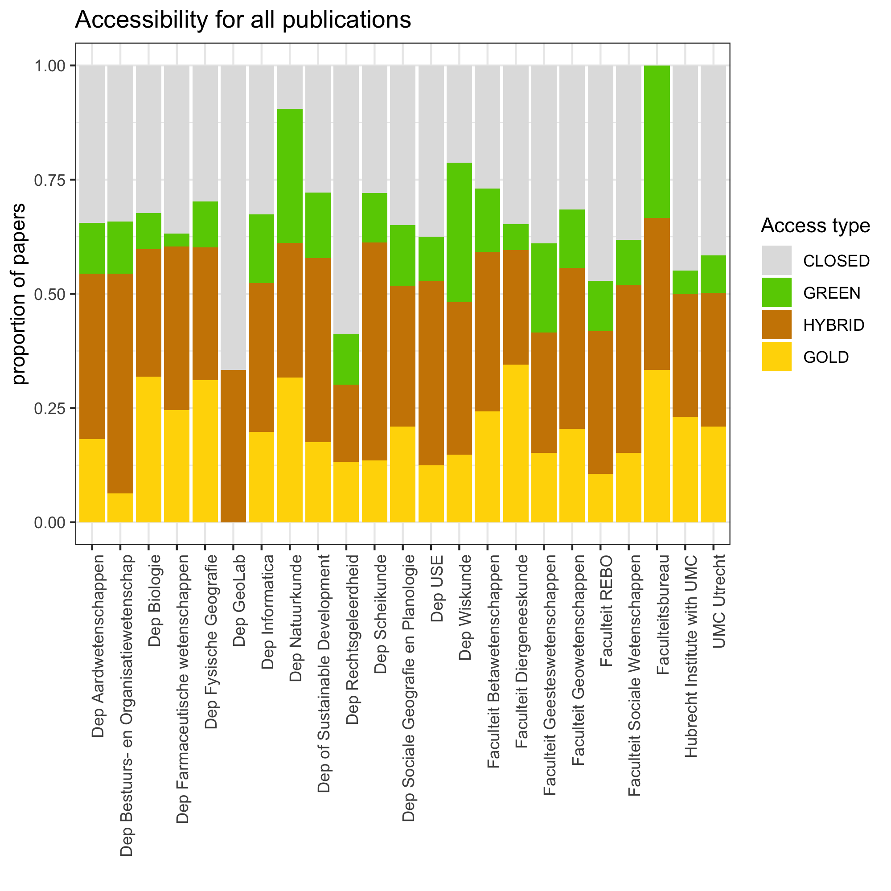
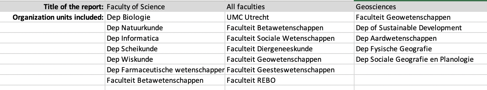
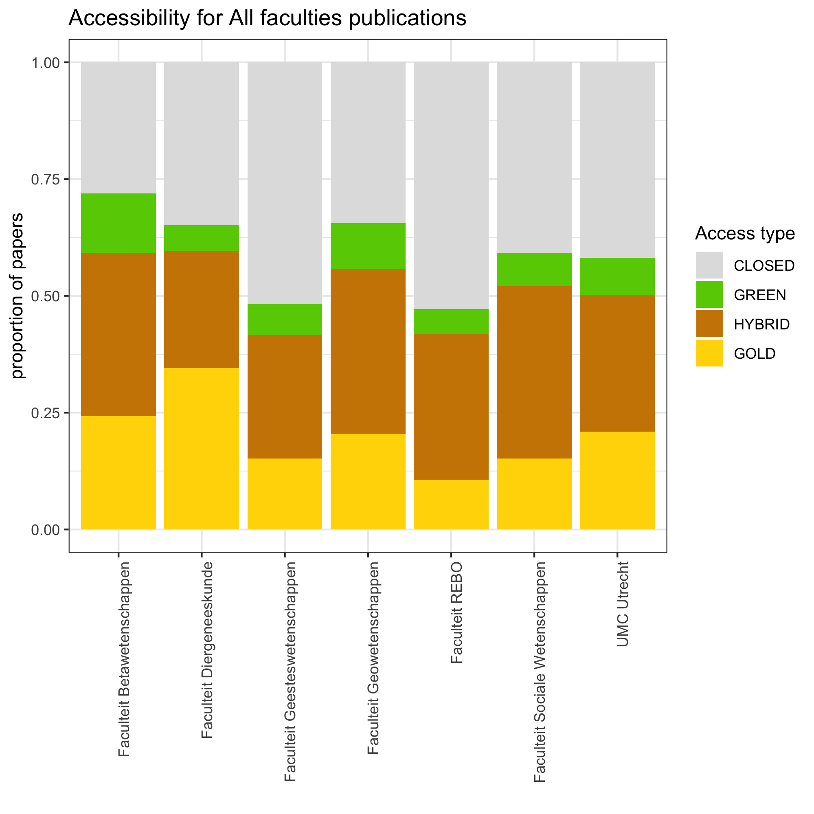
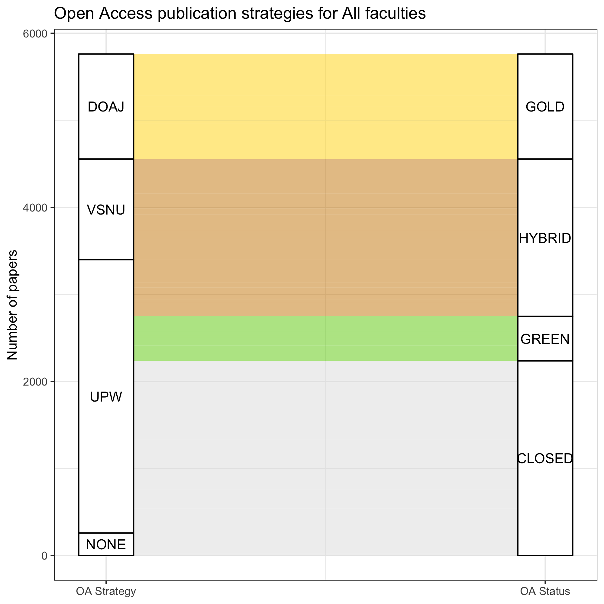
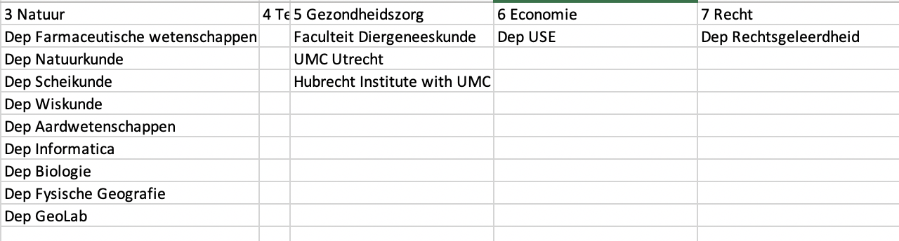
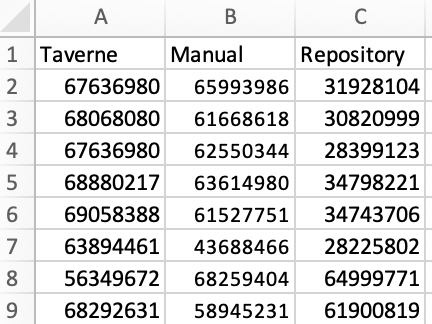

```{r setup, include=FALSE}
options(htmltools.dir.version = FALSE)
```

# Access to publications

Divided into the following subtypes:


| Category | Access type |
|:---:|:---|
| A | Gold |
| B | Hybrid |
| C | Green |
| D | Closed |

---
# Why monitor the output?

.pull-left-larger[
- National reporting (and comparison)

- Response to policy, local and national

- Designing strategies to improve


]
--
.pull-right-smaller[
_Aren't we comparing apples and oranges?_

_Rapid response is vital!_
]
---
# Automating the monitoring

For standardized and rapid reporting:


---
# Start your project (step 1)

1. Open Rstudio

1. Go to: **File** > **New Project** > **New Directory** > **New Project**

1. Give your project a name, and place it inside an accessible folder on your computer.

1. Click 'Create Project'


_NB: no need to create a git repository or open in a new session._
---
# Start your project (step 2)

1. Open an R script: **File** > **New File** > **R Script**

1. Save it inside your project folder as `monitoring_script.R`

   You can now type R code in this script, and execute the code as follows:

  - Place your cursor in the line of code you want to execute

  - Press  or ctrl + enter

  - When running multiple lines: select all lines, then press ‘Run’ or ctrl+enter
  
1. Give it a try! Type and execute the following line of code:
    ```{r first code}
    mean(1:10)
    ```


---
# Install the package

#### The following (probably) only needs to be done once...
... but you don't want to lose the code. So we will put it in the script.


1. Install the OA monitor from [its github repository](https://github.com/bvreede/OAmonitor):
```r
remotes::install_github("https://github.com/bvreede/OAmonitor")
```

1. enter '3' not to update any packages

--

#### When you are done, place a # in front of this line of code:
```{r}
# remotes::install_github("https://github.com/bvreede/OAmonitor")
```


---
# Load required libraries

Load the package (and some other libraries we will use)
```{r load libraries}
library(OAmonitor)
library(tidyverse)
```


---
# Input data

- Likely the export from a CRIS, or download from an online database (e.g. Scopus).

- May consist of multiple independent source files.

- Must be tabular, and can be either csv (comma or semicolon-separated), tsv (tab-separated), xlsx or xls.

- The workflow **requires** the following columns, which may or may not contain empty cells:

| Column | Explanation | Empty cells? |
|:---|:---|:---:|
|Unique ID | source-specific ID | No |
|Organization unit | e.g. departments, faculties (but can be anything) | No |
|ISSN | max 2 columns (e.g. ISSN + eISSN) | Yes |
|DOI | | Yes |

- Columns do not need to be renamed prior to use (but relevant columns do require a unique name)


---
# Prepare the input

1. [Download the excel template here](https://github.com/bvreede/OAmonitoring/blob/master/config/config_pub_files.xlsx).

1. Fill out the template:
  - Put each individual data file in a new column
  - Fill out the name of each relevant column per data file.

1. Place all source files in a subfolder of the project folder (e.g. `data/`).

1. Save the excel template inside the project folder.

For example:


---
# Load all data

- Your **configuration file** (filled out template) can be anywhere;
- Your **data files** are in a folder inside your project folder.


--

Using the configuration file, you will now load all data into a **combined data frame**.

```{r open everything, message=F}
df <- open_everything(file = "config_pub_files.xlsx",
                      dir = "data")
```
NB: `dir` is the folder where your data files are stored.

---
# Did it work?

```{r check data}
glimpse(df)
```


---
# Using external data

Data needed:
- VSNU (from an excel; provided)
- DOAJ (via API)
- Unpaywall (via API)

Running APIs takes a while (several hours), so the function contains the option to save, and then reload the data.

1. Prepare the following lines of code, but not run them yet;

1. Make sure that `save_results = T`, and fill out your own email address.

1. Then select **both** lines and run them. Keep your computer open while this runs.

```r
get_doaj(df, source = "api", save_results = T)

get_upw(df, source = "api", email = "YOUREMAIL@UNI.NL", save_results = T)
```
---
# Before part 2

- Please let us know if you have not yet received the VSNU data; we will send it to you.

- We recommend placing the VSNU excel file in the `data/` folder of your project.

- The DOAJ and UPW downloads will be placed in `data/clean/` (so it is useful if you already created the folder `data/`; if that does not exist, the program will create it for you).

- Confirm that the code has run: you will see a confirmation in your console, and you will see files show up in `data/clean/`.

- **If this does not happen**: please re-run the code (it will take a few hours), or get in touch with us.

--

## See you tomorrow!

---
class: inverse, middle, center
# Part 2
---
# Did something go wrong? Not to worry!

The following code will download mock files to finish the workshop.

```r
dir.create("testdata/")

ghdir <- "https://github.com/bvreede/presentations/blob/master/presentations/mockdata/"
files <- c("mock_config.xlsx","mock_doaj.csv","mock_upw.csv", "mock_vsnu.xlsx", "mockdata_dighum_2018.csv","mockdata_nice_2018.tsv")

for(f in files){
  download.file(
    url = paste(ghdir, f, sep = ""),
    destfile = paste("testdata/", f, sep = ""),
    method = "curl")
}
```

To load, run the following code (and skip the next few slides, until the classification):

```r
df <- open_everything(file = "testdata/mock_config.xlsx",
                      dir = "testdata")
vsnudf <- get_vsnu("testdata/mock_vsnu.xlsx")
doajdf <- get_doaj(df, source="testdata/mock_doaj.csv")
upwdf <- get_upw(df, source="testdata/mock_upw.csv")
```

---

# Load existing data: VSNU data

1. Place the VSNU dataframe in your project (can be anywhere, but we recommend `data/`).

1. Load it with `get_vsnu()`. You will get warnings. This has to do with the file itself, and does not create problems for the workflow. You can safely ignore this.

```{r load vsnu data, message=F, warning=T, error=F}
vsnudf <- get_vsnu("data/VSNU-cummulatief_WOA20200302.xlsx")
```

---
# Load existing data: DOAJ and Unpaywall

Load them from the saved files:

```{r load classification data, message=F, warning=F, error=F}
doajdf <- get_doaj(df, source="data/doaj_from_issn_2020-03-09.csv")
upwdf <- get_upw(df, source="data/upw_from_doi_2020-03-09.csv")
```

NB: make sure to use the right path to where these files were saved in your system! For you, this is likely `data/clean/`. Obviously, make sure you use the right file names, too.

---
# Make the classification

```{r classify}
df_class <- classify_oa(df,
                        doajdf=doajdf,
                        vsnudf=vsnudf,
                        upwdf=upwdf,
                        save_results = FALSE)
```
NB: by setting `save_results` to `TRUE`, you can save the dataframe with classifications.

Quickly check the classification in your data with `dplyr` code (not part of `OAmonitor`):
```{r first results}
df_class %>% 
  group_by(OA_label,OA_label_explainer) %>% 
  summarise(papers = n())
```

---
# How it works

Uses information in a hierarchical way to arrive at a classification.


---
# Make a report
! The summary chart made earlier is **not** accurate, as papers may appear more than once (e.g. if they are classified under multiple faculties)

To perform deduplication, we need to make a report.

```{r report to dataframe}
report_to_dataframe(df_class)
```

---
# Make some images

```{r total bar chart}
report_to_image(df_class, type="total")
```
---
# Make some images

```{r proportional bar chart}
report_to_image(df_class, type="prop")
```

#### This is a bug!

You should see a picture here, but it does not show up. This is what it should look like:



---
# Make some images

```{r alluvial}
StatStratum <- ggalluvial::StatStratum # without this line you will get an error
report_to_alluvial(df_class)
```

---
# Make a full report

A full report includes:
- a summarizing table, reporting on percentages per organization unit
- a bar chart with total numbers
- a bar chart with proportional numbers
- an alluvial diagram for all papers (not deduplicated!)

All these are saved objects. You can find them in `output/` or `figures/`.

#### Generate a full report like this:

```r
full_report(df_class)
```

---
# Custom report

To report on customized combinations of groups within your organization (e.g. all departments in a faculty, or all faculties). 

1. [Download the template here.](https://github.com/bvreede/OAmonitoring/blob/master/config/reports.xlsx)

1. Fill out the template with sub-groups of organization units (spelled *exactly* like in `org_unit`!) that you want to include in a single report. For example:

    

1. Give each list of sub-groups an appropriate title.

1. Save the filled out template in the project folder.


---
# Custom report

Run the code below to make all custom reports in one go.

NB: Make sure to specify `path_reports` to the location of your filled out custom template. Check the results in the folders `output/` and `figures/`

```{r subreport}
individual_reports(df_class, path_report = "subreports.xlsx")
```

---
# Custom report

Some of the results that you will see (in this case for all faculties):

.pull-left[

]
.pull-right[

]

Question: is the alluvial diagram here informative? Why? Why not?

---
# Reporting on HOOP 

A different kind of sub-report: aggregating organization units, and reporting on the headers. Here deduplication is done per aggregate. This can be used e.g. for HOOP-areas.

1. [Download the template here.](https://github.com/bvreede/OAmonitoring/blob/master/config/HOOP_areas.xlsx)

1. Add some of your organization units to the chart (just a few will do for now).

    

1. Run as follows:
    ```r
    hoop_report(df_class, path_hoop = "HOOP_areas.xlsx")
    ```
    
Output is once again saved in `output/` and `figures/`.

---
# Do we have sufficient information?

For some faculties or departments, getting information based on ISSNs and DOIs will not be sufficient. For example, at the faculty of Law, Economics and Governance:

.pull-left[
```{r alluvial REBO, fig.height = 6}
df_class %>%
  filter(org_unit == "Faculteit REBO") %>%
  report_to_alluvial(title = "REBO")
```
]

.pull-right[
*"NONE" means that either:*
- *There was no DOI associated to the publication*

- *Unpaywall did not return information for the DOI.*
]

---
# Screen for information level

`cutoff` is the maximum level of "NONE" allowed.

If `save = TRUE`, the resulting data will be saved to `data/clean/`.

```{r check info}
check_info(df_class, cutoff = 0.05, save=F)
```

---
# Screen for information level

```{r check info summary}
check_info(df_class) %>%
  group_by(org_unit) %>%
  summarise(n_papers = n())
```

More efficient than if we simply look at every paper that has "NONE":
```{r check all NONE, echo=F}
df_class %>%
  group_by(OA_label_explainer) %>%
  summarise(n_papers = n())
```

---
# Adding custom labels

After a manual screening, papers can be found to be accessible after all. Or, papers that are known to be in the repository, are not picked up by Unpaywall.

While too much customization will affect how comparable our results will be, it can be necessary to include these for internal reports.

Add custom labels through an excel document, listing the unique internal ID of papers:



You can make this yourself, but 
[you can find the template here.](https://github.com/bvreede/OAmonitoring/blob/master/data/custom_labels.xlsx)

---
# Apply custom labels

When applying the classification function, we now include the custom data:

```{r custom classification}
df_class_custom <- classify_oa(df, doajdf=doajdf, vsnudf=vsnudf, upwdf=upwdf,
                               custom=T, custom_path="custom_labels.xlsx")
```

Custom labels are only applied *after* all Gold and Hybrid classifications are given. Custom labels will only classify as Green.

.pull-left[
#### Without custom labels
```{r classification results, echo=F}
df_class %>% 
  group_by(OA_label,OA_label_explainer) %>% 
  summarise(papers = n())
```
]

.pull-right[
#### With custom labels
```{r custom results, echo=F}
df_class_custom %>% 
  group_by(OA_label,OA_label_explainer) %>% 
  summarise(papers = n())
```
]

---
# Consequence of custom

.pull-left[

```{r rebo before custom}
df_class %>% 
  filter(org_unit=="Faculteit REBO") %>% 
  report_to_alluvial(title = "REBO")
```
]

.pull-right[

```{r rebo after custom}
df_class_custom %>% 
  filter(org_unit=="Faculteit REBO") %>% 
  report_to_alluvial(title = "REBO")
```

]
---
# .

--- 
# Unpaywall vs OAmonitor

```{r upw vs oam, echo = F, error=F, warning=F}
library(ggalluvial)

oacols <- c("gray88","gold1","chartreuse3","orange3")

df_sum <- df_class %>%
  group_by(upw, OA_label) %>%
  deduplicate() %>%
  summarise(n_papers = n())

ggplot(df_sum,
         aes(y = n_papers,
             axis1 = upw, axis2 = OA_label)) +
    geom_alluvium(aes(fill = OA_label),
                  width = 0, knot.pos = 0, reverse = FALSE) +
    guides(fill = FALSE) +
    geom_stratum(width = 1/8, reverse = FALSE) +
    geom_text(stat = "stratum", infer.label = TRUE, reverse = FALSE) +
    scale_x_continuous(breaks = 1:2, labels = c("Unpaywall", "OAmonitor")) +
    scale_fill_manual(values = oacols) +
    theme_bw() +
    labs(title = "Differences between Unpaywall and OAmonitor",
         y = "Number of papers")

```


---
class: inverse, middle, center
# Thank you!

---
# Links

[OA monitor: R package](https://github.com/bvreede/OAmonitor) (under development)

[OA monitoring: our old workflow, with documentation](https://github.com/bvreede/OAmonitoring) (deprecated)
