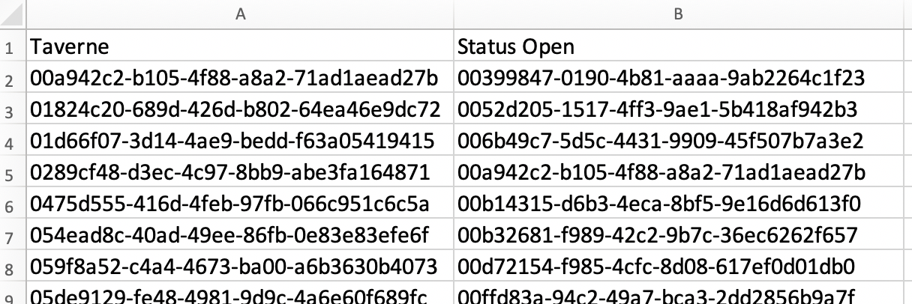

```{r setup, include=FALSE}
options(htmltools.dir.version = FALSE)
```

# Access to publications

Divided into the following subtypes:


| Category | Access type |
|:---:|:---|
| A | Gold |
| B | Hybrid |
| C | Green |
| D | Closed |

---
# Why monitor the output?

.pull-left-larger[
- National reporting (and comparison)

- Response to policy, local and national

- Designing strategies to improve


]
--
.pull-right-smaller[
_Aren't we comparing apples and oranges?_

_Rapid response is vital!_
]
---
# Automating the monitoring

For standardized and rapid reporting:


---
# Start your project (step 1)

1. Open Rstudio

1. Go to: **File** > **New Project** > **New Directory** > **New Project**

1. Give your project a name, and place it inside an accessible folder on your computer.

1. Click 'Create Project'


_NB: no need to create a git repository or open in a new session._
---
# Start your project (step 2)

1. Open an R script: **File** > **New File** > **R Script**

1. Save it inside your project folder as `monitoring_script.R`

   You can now type R code in this script, and execute the code as follows:

  - Place your cursor in the line of code you want to execute

  - Press  or ctrl + enter

  - When running multiple lines: select all lines, then press ‘Run’ or ctrl+enter
  
1. Give it a try! Type and execute the following line of code:
    ```{r first code}
    mean(1:10)
    ```


---
# Install the package

#### The following (probably) only needs to be done once...
... but you don't want to lose the code. So we will put it in the script.


1. Make sure `devtools` is installed:
```r
install.packages("devtools")
```

1. Install the OA monitor from [its github repository](https://github.com/bvreede/OAmonitor):
```r
devtools::install_github("https://github.com/bvreede/OAmonitor")
```

1. enter '3' not to update any packages

--

#### When you are done, place a # in front of these lines of code:
```{r}
# install.packages("devtools")
# devtools::install_github("https://github.com/bvreede/OAmonitor")
```


---
# Load required libraries

Load the package (and some other libraries we will use)
```{r load libraries}
library(OAmonitor)
library(tidyverse)
```


---
# Input data

- Likely the export from a CRIS, or download from an online database (e.g. Scopus).

- May consist of multiple independent source files.

- Must be tabular, and can be either csv (comma or semicolon-separated), tsv (tab-separated), xlsx or xls.

- The workflow **requires** the following columns, which may or may not contain empty cells:

| Column | Explanation | Empty cells? |
|:---|:---|:---:|
|Unique ID | source-specific ID | No |
|Organization unit | e.g. departments, faculties (but can be anything) | No |
|ISSN | max 2 columns (e.g. ISSN + eISSN) | Yes |
|DOI | | Yes |

- Columns do not need to be renamed prior to use (but relevant columns do require a unique name)


---
# Prepare the input

1. [Download the excel template here](https://github.com/bvreede/OAmonitoring/blob/master/config/config_pub_files.xlsx).

1. Fill out the template:
  - Put each individual data file in a new column
  - Fill out the name of each relevant column per data file.

1. Place all source files in a subfolder of the project folder (e.g. `data/`).

1. Save the excel template inside the project folder.

For example:


---
# Load all data

- Your **configuration file** (filled out template) can be anywhere;
- Your **data files** are in a folder inside your project folder.


--

Using the configuration file, you will now load all data into a **combined data frame**.

```{r open everything, message=F}
df <- open_everything(file = "config_pub_files.xlsx",
                      dir = "data")
```
NB: `dir` is the folder where your data files are stored.

---
# Did it work?

```{r check data}
glimpse(df)
```


---
# Using external data

Data needed:
- VSNU (from an excel; provided)
- DOAJ (via API)
- Unpaywall (via API)

Running APIs takes a while (several hours), so the function contains the option to save, and then reload the data.

1. Prepare the following lines of code, but not run them yet;

1. Make sure that `save_results = T`, and fill out your own email address.

1. Then select **both** lines and run them. Keep your computer open while this runs.

```r
get_doaj(df, source = "api", save_results = T)

get_upw(df, source = "api", email = "YOUREMAIL@UNI.NL", save_results = T)
```
---
# Before part 2

- Please let us know if you have not yet received the VSNU data; we will send it to you.

- We recommend placing the VSNU excel file in the `data/` folder of your project.

- The DOAJ and UPW downloads will be placed in `data/clean/` (so it is useful if you already created the folder `data/`; if that does not exist, the program will create it for you).

- Confirm that the code has run: you will see a confirmation in your console, and you will see files show up in `data/clean/`.

- **If this does not happen**: please re-run the code (it will take a few hours), or get in touch with us.

--

## See you tomorrow!

---
class: inverse, middle, center
# Part 2
---
# Did something go wrong? Not to worry!

The following code will download mock files to finish the workshop.

```r
dir.create("testdata/")

ghdir <- "https://github.com/bvreede/presentations/blob/master/presentations/mockdata/"
files <- c("mock_config.xlsx","mock_doaj.csv","mock_upw.csv", "mock_vsnu.xlsx", "mockdata_dighum_2018.csv","mockdata_nice_2018.tsv")

for(f in files){
  download.file(
    url = paste(ghdir, f, sep = ""),
    destfile = paste("testdata/", f, sep = ""),
    method = "curl")
}
```

To load, run the following code (and skip the next few slides, until the classification):

```r
df <- open_everything(file = "testdata/mock_config.xlsx",
                      dir = "testdata")
vsnudf <- get_vsnu("testdata/mock_vsnu.xlsx")
doajdf <- get_doaj(df, source="testdata/mock_doaj.csv")
upwdf <- get_upw(df, source="testdata/mock_upw.csv")
```

---

# Load existing data: VSNU data

1. Place the VSNU dataframe in your project (can be anywhere, but we recommend `data/`).

1. Load it with `get_vsnu()`. You will get warnings. This has to do with the file itself, and does not create problems for the workflow. You can safely ignore this.

```{r load vsnu data, message=F, warning=T, error=F}
vsnudf <- get_vsnu("data/VSNU-cummulatief_WOA20200302.xlsx")
```

---
# Load existing data: DOAJ and Unpaywall

1. You probably already have this data loaded, unless you restarted your Rstudio since yesterday.

1. Check your environment (top right window) for the presence of `doajdf` and `upwdf` (or whatever names you gave them yesterday).

1. **Only if you do not have these objects**, you can load them from the saved files:

```{r load classification data, message=F, warning=F, error=F}
doajdf <- get_doaj(df, source="data/doaj_from_issn_2020-03-09.csv")
upwdf <- get_upw(df, source="data/upw_from_doi_2020-03-09.csv")
```

NB: make sure to use the right path to where these files were saved in your system! Probably this is `data/clean/`. Obviously, make sure you use the right file names, too.

---
# Make the classification

```{r classify}
df_class <- classify_oa(df,
                        doajdf=doajdf,
                        vsnudf=vsnudf,
                        upwdf=upwdf,
                        max_year=2019)
```

Check the classification in your data:
```{r first results}
df_class %>% 
  group_by(OA_label,OA_label_explainer) %>% 
  summarise(papers = n())
```
---
# How it works

Uses information in a hierarchical way to arrive at a classification.


---
# Make some images

```{r}
report_to_image(df_class)
```

---
# Custom report


```r
individual_reports(df_class, "data/custom_reports.xlsx")
```

---
# Custom report

Saved files include, per sub-report:
- Bar plots (proportional and total)
- Alluvial diagrams (total, showing OA strategy/classification)
- Summarizing dataframe (as csv)

.pull-left[

]
.pull-right[

]
---

# Adding custom labels

Using two columns in the Delft data:
- Taverne
- Presence of publication in repository

We make an excel with labels, listing the unique IDs of papers:


---

# Re-classifying the data

When applying the classification function, we now include the custom data:

```{r}
df_class_custom <- classify_oa(df,
                        doajdf=doajdf,
                        vsnudf=vsnudf,
                        upwdf=upwdf,
                        max_year=2019,
                        custom=T,
                        custom_path="data/custom_labels.xlsx")


df_class_custom %>% 
  group_by(OA_label,OA_label_explainer) %>% 
  summarise(papers = n())
```

---
# Make alluvial


--- 
# Screen for faculties with too little data


---

