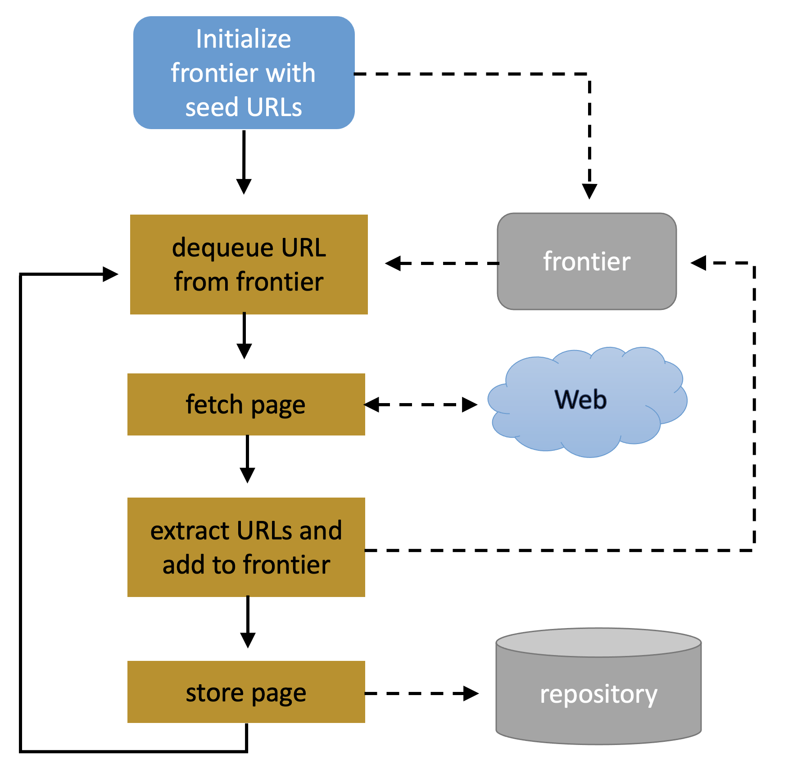
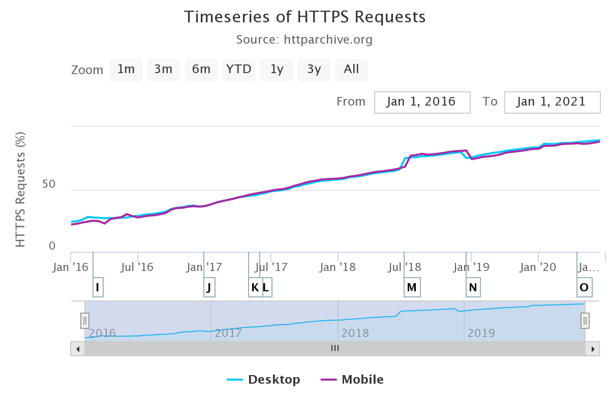

```{r setup, include=FALSE}
options(htmltools.dir.version = FALSE)
```
#### These slides:
[tinyurl.com/analytics20210315](https://tinyurl.com/analytics20210315)

#### License:

```{r, echo=F, out.width=150}
knitr::include_graphics("https://mirrors.creativecommons.org/presskit/buttons/88x31/png/by.png")
```

All content licensed under [CC-BY 4.0](https://creativecommons.org/licenses/by/4.0/) except when indicated otherwise.
---
# 4.1 Directed Networks


- Edge goes _from_ source node _to_ target node

- Each node has a degree
  - in-degree: number of incoming links
  - out-degree: number of outgoing links
  
--

- Observed in information networks, such as:
  - email
  - wikipedia
  - journal publications
  
---
# 4.2 The web

#### The world wide web as an information network:
- **Node**: anything with a URL
- **Edge**: link to a URL (directed)

--

#### Browser and server communicate through HTTP protocol:
- _Client_ sends URL (e.g. host.npr.org)
- _DNS_ returns IP (e.g. 216.35.221.76)
- _Client_ sends request (e.g.)
  ```
  GET / HTTP/1.1
  Host: npr.org
  ```
- _Server_ returns content (e.g.)
  ```
  HTTP 1.1 200 OK
  Content-Type: text/html
  
  <HTML>
  <HEAD>
  <Title>National Public Radio</Title>
  ...
  </HTML>
  ```

---
# Web crawler

.pull-left[
#### Breadth-first search algorithm running on the Web link graph

- Starts from (high-quality/relevant) seed pages
- Recursively extracts links and adds them to 'frontier'
- Technically challenging, but conceptually simple


#### The frontier:

- First in, first out
- Pages at distance _n-1_ before those at distance _n_
- Thus: high initial relevance to seed
- Often optimized, revisit known pages
]

.pull-right[

```{r, echo=F, out.width=400}

```

]

---
# Web structure and size

**Web graph**: the network of Web pages and hyperlinks

- Many (weakly) connected components
- Skewed size distribution

.pull-left[
```{r, echo=F}

knitr::include_graphics("https://www.pingdom.com/wp-content/uploads/2018/11/imageD.png")
```

[Copyright: pingdom.com](https://www.pingdom.com/blog/webpages-are-getting-larger-every-year-and-heres-why-it-matters/)
]

.pull-right[
```{r, echo=F}

```
[Copyright: HTTP archive](https://httparchive.org/reports/state-of-the-web#pctHttps)
]

---
# Bow-tie structure
