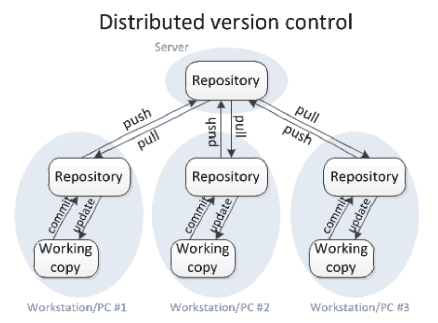
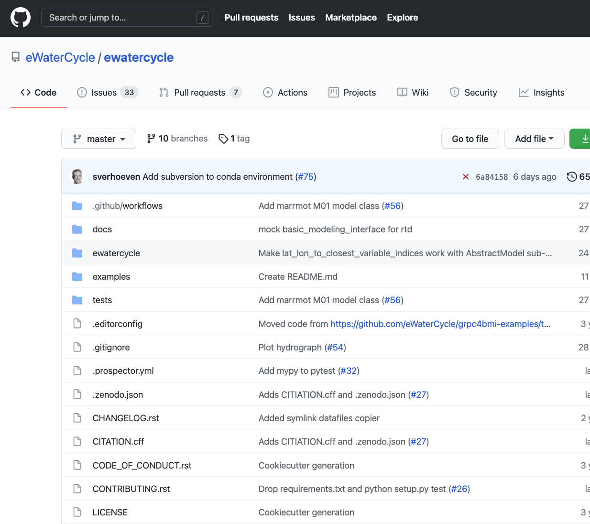

```{r setup, include=FALSE}
options(htmltools.dir.version = FALSE)
knitr::opts_chunk$set(python.reticulate=F)
```

# Let's do this!

The collaborative doc: [tinyurl.com/ssi-ml-day2-introduction-git](https://tinyurl.com/ssi-ml-day2-introduction-git)

.pull-left[
- Note in the document: 
  - The **command log**, where we will store commands in live coding sessions
  - The **notes**, where we will add resources and tips discussed
  - The **check-in**, where we will ask for your answers

- Please ask for help in Discord: #questions channel

- Close as many unnecessary windows and programs as possible.
] 

--

.pull-right[

| | Our schedule |
|:--|:--|
|9:00 | Introduction to Git & each other|
|_10:00_ | _break_ |
|10:15 | Git and GitHub (/BitBucket/GitLab) |
|_11:15_ | _break_|
| 11:30 | Workflow with Git |
| 12:30 | _end_ |

]
---
# Before we start

Please check that your SSH key pair is working.

Github:
```bash
ssh git@github.com
```

Gitlab:
```bash
ssh -T git@gitlab.example.com
```

- If you need to verify the authenticity of the host? Type `yes`
- You should then see something like:
  ```
  Hi bvreede! You've successfully authenticated, but GitHub does not provide shell access.
  Connection to github.com closed.
  ```

Use the check-in to let us know that your SSH works!

---
# Why do you need version control?

.pull-left[

- It will help you manage ~~your code~~ most of your files (it is like track changes on steroids: it applies to all files in a folder).

- It allows you to trace back your steps: if something breaks, you can figure out what happened.

- NO MORE thesis_final_final_SERIOUSLYFINAL.Rmd

]

.pull-right[
```{r echo=FALSE, out.width=400}
knitr::include_graphics("http://www.phdcomics.com/comics/archive/phd101212s.gif")
```
]

---
# Why do you need version control?

.pull-left[

#### But even better:
- a good version control system allows you to collaborate and share;

- it can facilitate controlled addition of new features;

- you can experiment without breaking your project!

]

.pull-right[
```{r echo=FALSE, out.width=400}
knitr::include_graphics("http://www.phdcomics.com/comics/archive/phd101212s.gif")
```
]

---
# What is Git?
.pull-left[
- Distributed version control system: everyone works on their own copy, a distinct entity from the remote repository.

- Open Source, written by Linus Torvalds (of Linux fame)

- Well-known and much used, current standard for software

- Very efficient use of storage, while retaining all history

- Key version control system for the website **Github** (and others)
]

.pull-right[

```{r echo=FALSE}


```
]

---
# But OMG the command line!


.pull-left[

- Yes, Git is written for the command line...

- ... but many GUI-clients exist nowadays...

- ...and most coding IDEs have built-in Git!

_Also, pst... most of my Git skills come from sticky notes and stackoverflow._

]


.pull-right[

]


---
# How does Git work?

.pull-left[

#### Log the changes in a narrative way

- `commit` a (set of) changes, with a designated message


]

.pull-right[

]

---
# How does Git work?

.pull-left[

#### Log the changes in a narrative way

- `commit` a (set of) changes, with a designated message

#### Branch off to work on a new feature

- Work on a new feature or experiment on a dedicated `branch` or `fork`

]

.pull-right[

]

---
# How does Git work?

.pull-left[

#### Log the changes in a narrative way

- `commit` a (set of) changes, with a designated message

#### Branch off to work on a new feature

- Work on a new feature or experiment on a dedicated `branch` or `fork`

#### Merge back to apply the new feature

- `pull` or `merge` a collection of changes to combine them with the current state


]

.pull-right[

]

---
# How does Git work?

.pull-left[

#### Log the changes in a narrative way

- `commit` a (set of) changes, with a designated message

#### Branch off to work on a new feature

- Work on a new feature or experiment on a dedicated `branch` or `fork`

#### Merge back to apply the new feature

- `pull` or `merge` a collection of changes to combine them with the current state

#### Work locally, publish remotely

- Git works perfectly fine if only used locally...

- ...but shines in combination with Github!

]

.pull-right[

]

---
class: inverse, center, middle

# Let's make a repository!

---
# Your workflow

```{r echo=FALSE}
knitr::include_graphics("https://images.osteele.com/2008/git-transport.png")

```

.footnote[credit: [osteele.com](https://blog.osteele.com/2008/05/my-git-workflow/)]
---
# Your workflow

What command do you use when you want to download remote changes?

1.
```bash
git pull
```

2.
```bash
git commit
```

3.
```bash
git push
```

---
# Your workflow

What command do you use when you want to log new changes?

1.
```bash
git pull
```

2.
```bash
git commit
```

3.
```bash
git push
```

---

# Enjoy, but git responsibly

- **Don't** leave work without committing it!
- **Do** commit small, but atomic changes, with a meaningful commit message.

--

- **Don't** leave work without committing it!
- **Do** commit small, but atomic changes, with a meaningful commit message.

---
class: inverse, center, middle

# NB. The following slides are not meant for teaching :)

---
Set up your system to use git!

```bash
git -h
git config --global user.name "Barbara Vreede"
git config --global user.email "b.vreede@esciencecenter.nl"
# or you can keep the user name private
git config --global user.email bvreede@users.noreply.github.com
git config --list
```

In Git, the project folder is central.

```bash
cd Sandbox
mkdir beautiful_soup
cd beautiful_soup
git init
git branch -m main
```

---
Adding ingredients to our soup
```
nano soup.md
```

Write in Nano:
```
# Beautiful soup

## Ingredients

- 3 carrots
- 2 sticks of celery
- 1 onion
- as much garlic as you can find
- cilantro
```
Close with `ctrl + X` > `Y` > `enter`

Add it to git
```
git add soup.md
git commit -m "the ingredients for my soup"
```

---
- Make a repo on Github
- Copy the SSH address

```
git remote add origin git@github.com:bvreede/beautiful_soup.git
```

Made a mistake? Need to change protocol?
```
git remote set-url origin <the-actual-address>
```

Connect your local repo to the remote

```bash
git push -u origin main
```
---
Add a readme in github

```bash
git pull
```

---
Add a recipe

```bash
nano soup.md
```

Write in Nano:
```
## Recipe

1. Cut all the veggies
2. Throw them in a pan
3. Turn up the heat
4. Add some water
5. Enjoy
```
Close with `ctrl + X` > `Y` > `enter`

---

- workflow add > commit > push
- what happens with a merge conflict: make an edit remotely and locally and pull the change
- Nano delete lines with `^K`
- git status
- git log
  - git log --oneline
  - git log --oneline --graph
- git diff
- make a directory, show nothing happens: git tracks files


---
# exercise

Which command(s) below would save the changes of myfile.txt to my local Git repository?


1.
```bash
$ git commit -m "my recent changes"
```
2.
```bash
$ git init myfile.txt
$ git commit -m "my recent changes"
```
3.
```bash
$ git add myfile.txt
$ git commit -m "my recent changes"
```
4.
```bash
$ git commit -m myfile.txt "my recent changes"
```

---
# history
```bash
git diff HEAD~1 soup.md
git diff HEAD~3 README.md
git show 6ba95cb 
git status
git checkout HEAD~1
git git switch -c newbranch
```


---
# ignoring
```bash
nano .gitignore
```

---

